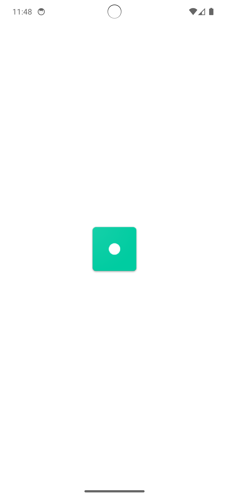

# TheMovieDB Flutter Task 🎬

A Flutter mobile application created as part of a coding assessment. This app demonstrates key Flutter development skills including API integration, state management using BLoC, offline caching, infinite scrolling, and clean modular architecture.

---

## 📱 Features

### ✅ Mandatory Features
- **Popular People List:** Displays a paginated list of popular people (actors, directors, etc.) from [The Movie DB API](https://developers.themoviedb.org/3/people/get-popular-people) with infinite scrolling.
- **Person Details View:** Tapping a person opens a details screen with basic info and a grid of their images.
- **Image Viewer:** Tapping an image shows it fullscreen with a **download** option to save it to the device gallery.
- **BLoC State Management:** Organized and scalable state handling using Cubit from `flutter_bloc`.

### 🌐 Bonus Features
- **Offline Support:** Uses Hive to cache and load the list of popular people when offline.
- **Splash Screen:** Custom splash screen shown while the app loads.

---

## 📽️ Demo Video

---

## 📦 Download APK

[⬇️ Download APK](https://drive.google.com/file/d/187GscsqHY4TJrPqbkxqHl1gRamZhHPDs/view?usp=sharing)

---

## 📸 Screenshots

| Splash Screen | Popular People List | Person Details | Full Image Viewer |
|---------------|---------------------|----------------|--------------------|
|  |  |  |  |

---

## 🧱 Architecture

The app uses clean architecture with the following layers:
- **Presentation Layer:** UI widgets and Cubits for state
- **Domain Layer:** Repositories (abstracted)
- **Data Layer:** API service (Dio) and local caching (Hive)
- **Core Layer:** Constants, utils, error handling, etc.

---

## 🔐 Environment Configuration

The app uses an `.env` file to store the **TMDB API Key** securely.

